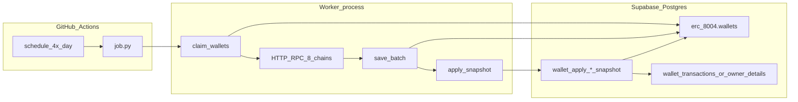
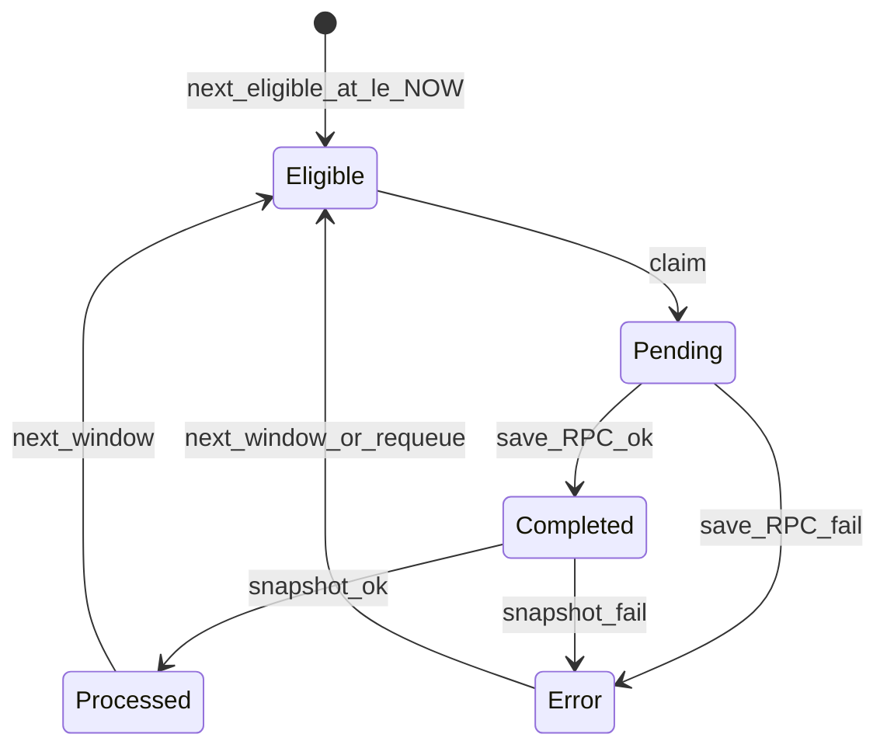
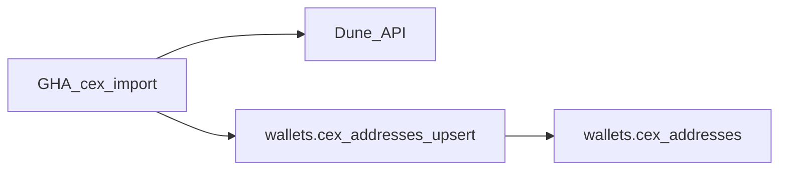

# Architecture

Python batch workers run on **GitHub Actions**, talk to **Supabase Postgres** over a pooler DSN, and finish each wallet with an **inline SQL snapshot** RPC. There is no Cloudflare Worker or Edge Function in the hot path.

## System diagram



## Common pipeline

Every worker loop iteration:

1. **Claim** — `FOR UPDATE SKIP LOCKED` on eligible rows; status `Pending`; bump `next_eligible_at` by `CLAIM_STALE_SECONDS` (default 2h).
2. **RPC** — parallel HTTP (public RPCs → Alchemy) for each claimed wallet.
3. **Save** — batch `UPDATE` JSON + `Completed` or `Error` + schedule next eligibility.
4. **Snapshot** — for each `Completed` id, call `erc_8004.wallet_apply_*_snapshot(wallet_id)` → destination tables + status `Processed`.

If claim or save/snapshot fails after DB retries, the job **logs and continues** the loop until `MAX_RUNTIME_SECONDS` (wallets left `Pending` are reclaimed after the stale window).

## Status state machine



| Status | Who sets it |
|---|---|
| `Pending` | Worker claim |
| `Completed` / `Error` | Worker save (RPC outcome) |
| `Processed` | Snapshot SQL function |
| `Error` (after Completed) | Worker mark after snapshot failure |

## Workers

| Worker | Workflow | Concurrency group | Parallelism |
|---|---|---|---|
| `wallet_nonce_balance_daily` | `wallet-nonce-balance-daily.yml` | per `worker-a` / `worker-b` | Matrix: 2 runners |
| `owner_wallet_origin` | `owner-wallet-origin.yml` | `owner-wallet-origin` | 1 runner |
| `owner_wallet_nonce_balance_monthly` | `owner-wallet-nonce-balance-monthly.yml` | `owner-wallet-nonce-balance-monthly` | 1 runner |
| `cex_addresses_import` | `cex-addresses-import.yml` | `cex-addresses-import` | 1 runner |

Claim workers schedule: `0 0,6,12,18 * * *` UTC + `workflow_dispatch`.  
CEX import schedule: `0 0 1,16 * *` UTC + `workflow_dispatch`.

### What each worker does

| Worker | Input flag | Output |
|---|---|---|
| daily | `is_valid_import_current_nonce_and_balance_daily` | Balance/nonce JSON → `wallet_transactions` + `chain_nonces` |
| monthly | `is_valid_import_current_nonce_and_balance_monthly` | Balance/nonce JSON → `wallet_owner_details` (current metrics) |
| origin | same monthly flag | First-activity history JSON → `wallet_owner_details.first_transaction_at` |
| cex import | n/a | Dune rows → `wallets.cex_addresses` via `cex_addresses_upsert` |

## Reference-data workers

`cex_addresses_import` does **not** use claim / `next_eligible_at`. Pipeline:

1. Fetch latest Dune query result (paginated HTTP).
2. Fail if zero rows.
3. Call `wallets.cex_addresses_upsert(p_rows jsonb)` once with the full row array.



## Time budgets

| Limit | Value |
|---|---|
| GHA `timeout-minutes` | 360 (claim workers), 30 (cex import) |
| `MAX_RUNTIME_SECONDS` | 19800 (~5.5h) — soft stop inside claim `job.py` |
| Postgres `statement_timeout` | 300s |
| HTTP client timeout | ~10s (daily/monthly), ~30s (origin), ~120s (Dune) |

## Resilience

Implemented in each `src/db.py` + `job.py`:

- Up to **3 retries** on connection drops, statement timeout, deadlock
- **Reconnect** on `OperationalError` / `InterfaceError` (not required for timeout/deadlock)
- Claim failure → sleep + continue loop
- Save/snapshot failure → skip batch (wallets stay `Pending`), continue loop
- Per-wallet HTTP failures → `Error` payload; batch continues

## Package layout (per worker)

There is **no shared Python package**. Patterns are copy-pasted across workers:

```
workers/<name>/
├── job.py              # asyncio batch loop (or sync one-shot for reference data)
├── pyproject.toml      # uv / Python 3.12
├── .env.example
├── README.md
└── src/
    ├── db.py           # claim / save / snapshot / reconnect (or upsert RPC)
    ├── query.py        # balance+nonce (daily, monthly)
    ├── origin.py       # binary-search first activity (origin only)
    ├── dune.py         # Dune HTTP client (cex import only)
    ├── rpc.py
    ├── alchemy.py
    ├── networks.py     # 8-chain public RPC list
    └── address.py
```

Origin also has `scripts/check_pending.py` and `scripts/compare_smoke.py`.

## CI env defaults (workflows)

| Worker | CONCURRENCY | CLAIM_BATCH_SIZE | CLAIM_STALE_SECONDS |
|---|---|---|---|
| daily | 20 | 200 | 7200 |
| origin | 4 | 50 | 7200 |
| monthly | 20 | 200 | 7200 |
| cex import | n/a | n/a | n/a |

Secrets: `SUPABASE_DB_URL` (required), `ALCHEMY_KEY` (recommended for claim workers), `DUNE_KEY` (cex import). Daily sets `WORKER_ID` from the matrix.

## Related docs

- [SUPABASE.md](./SUPABASE.md) — columns, RPCs, monitoring SQL
- [OPS.md](./OPS.md) — operations / stuck states
- [AGENTS.md](../AGENTS.md) — agent entry point
