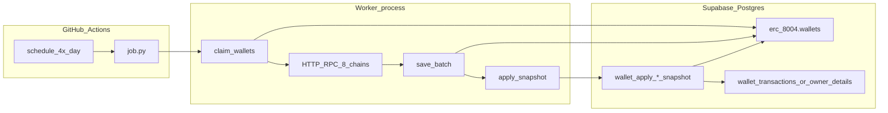
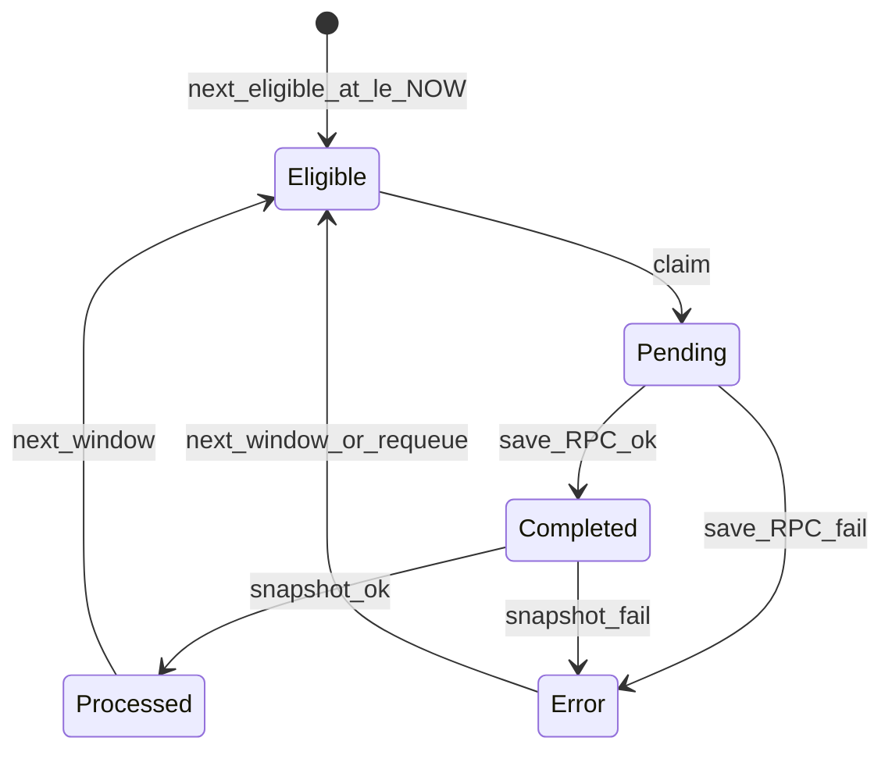
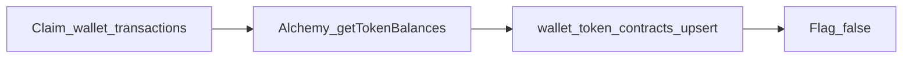
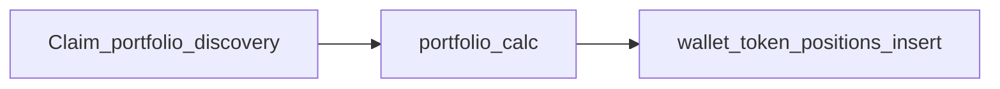
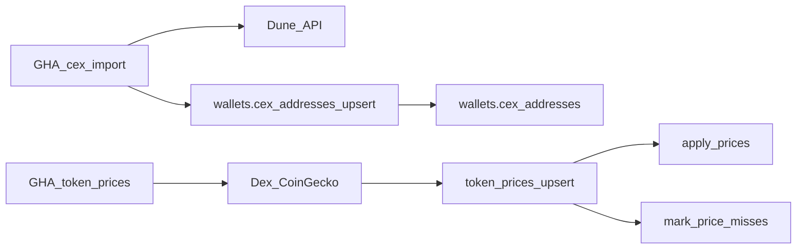

# Architecture

Python batch workers run on **GitHub Actions**, talk to **Supabase Postgres** over a pooler DSN, and finish each wallet with an **inline SQL snapshot** RPC. There is no Cloudflare Worker or Edge Function in the hot path.

## System diagram



## Common pipeline

Every worker loop iteration:

1. **Claim** — `FOR UPDATE SKIP LOCKED` on eligible rows; status `Pending`; bump `next_eligible_at` by `CLAIM_STALE_SECONDS` (default 2h).
2. **RPC** — parallel HTTP (public RPCs → Alchemy) for each claimed wallet.
3. **Save** — batch `UPDATE` JSON + `Completed` or `Error` + schedule next eligibility.
4. **Snapshot** — for each `Completed` id, call `erc_8004.wallet_apply_*_snapshot(wallet_id)` → destination tables + status `Processed`.

If claim or save/snapshot fails after DB retries, the job **logs and continues** the loop until `MAX_RUNTIME_SECONDS` (wallets left `Pending` are reclaimed after the stale window).

## Status state machine



| Status | Who sets it |
|---|---|
| `Pending` | Worker claim |
| `Completed` / `Error` | Worker save (RPC outcome) |
| `Processed` | Snapshot SQL function |
| `Error` (after Completed) | Worker mark after snapshot failure |

## Workers

| Worker | Workflow | Concurrency group | Parallelism |
|---|---|---|---|
| `wallet_nonce_balance_daily` | `wallet-nonce-balance-daily.yml` | per `worker-a` / `worker-b` | Matrix: 2 runners |
| `owner_wallet_origin` | `owner-wallet-origin.yml` | `owner-wallet-origin` | 1 runner |
| `owner_wallet_nonce_balance_monthly` | `owner-wallet-nonce-balance-monthly.yml` | `owner-wallet-nonce-balance-monthly` | 1 runner |
| `cex_addresses_import` | `cex-addresses-import.yml` | `cex-addresses-import` | 1 runner |
| `token_prices_import` | `token-prices-import.yml` | `token-prices-import` | 1 runner |
| `wallet_token_contracts_discovery` | `wallet-token-contracts-discovery.yml` | `wallet-token-contracts-discovery` | 1 runner |
| `wallet_token_portfolio_discovery` | `wallet-token-portfolio-discovery.yml` | `wallet-token-portfolio-discovery` | 1 runner |
| `wallet_lp_positions_discovery` | `wallet-lp-positions-discovery.yml` | `wallet-lp-positions-discovery` | 1 runner |

Claim workers schedule: `0 0,6,12,18 * * *` UTC + `workflow_dispatch`.  
CEX import schedule: `0 0 1,16 * *` UTC + `workflow_dispatch` (1st and 16th of each month ≈ every 15 days, same cadence as the former walcert CEX import cron).  
Token prices import schedule: `0 0,6,12,18 * * *` UTC + `workflow_dispatch` (DexScreener → CoinGecko enrich; same cadence as claim workers).

### What each worker does

| Worker | Input flag | Output |
|---|---|---|
| daily | `is_valid_import_current_nonce_and_balance_daily` | Balance/nonce JSON → `wallet_transactions` + `chain_nonces` |
| monthly | `is_valid_import_current_nonce_and_balance_monthly` | Balance/nonce JSON → `wallet_owner_details` (current metrics) |
| origin | same monthly flag | First-activity history JSON → `wallet_owner_details.first_transaction_at` |
| cex import | n/a | Dune rows → `wallets.cex_addresses` via `cex_addresses_upsert` |
| token prices | n/a | Unpriced ERC-20s → Dex/CG → `token_prices` → apply hits / mark misses |
| token contracts discovery | `wallet_transactions.does_need_discovery_contracts` + `chains.subdomain_alchemy` | Alchemy ERC-20 balances → `wallets.wallet_token_contracts` via `wallet_token_contracts_upsert` |
| token portfolio discovery | `does_need_portfolio_discovery` after contract discovery | Alchemy amounts + DeFiLlama → fungible `wallet_token_positions_insert` |
| LP positions discovery | `does_need_lp_discovery` after portfolio discovery | NFT + `lp_pools` → `wallet_lp_positions_upsert` |

## Token contracts discovery

Claims **`erc_8004.wallet_transactions`** rows (not `wallets`). Pipeline:

1. Claim rows with `does_need_discovery_contracts IS DISTINCT FROM FALSE` and non-empty `chains.subdomain_alchemy`.
2. Alchemy `alchemy_getTokenBalances(address, "erc20")` (paginate); keep balance > 0.
3. `wallets.wallet_token_contracts_upsert(wallet_id, chain_id, rows)` then set flag `FALSE`.

Design / business rationale (ERC-20 inventory, Alchemy Free, Llama → Dex → CG): [TOKEN_CONTRACTS_DISCOVERY_ALCHEMY.md](./TOKEN_CONTRACTS_DISCOVERY_ALCHEMY.md).



## Token portfolio discovery

After contract discovery succeeds, claims rows with `does_need_portfolio_discovery` pending:

1. Load contracts from `wallet_token_contracts`.
2. Shared `portfolio_calc` (Alchemy balances + DeFiLlama prices; no `token_prices`; sets `token_quality` / `quality_reason`).
3. `wallet_token_positions_insert` (INSERT only; native as `contract_address='native'`).
   Rediscovery after pricing/quality changes: `wallet_token_portfolio_discovery_reset.sql` then re-run the workflow.
   **Does not** discover Uniswap V3 / LP NFT positions — see LP discovery below.



## Reference-data workers

`cex_addresses_import` and `token_prices_import` do **not** use claim / `next_eligible_at`.

**CEX:** Fetch latest Dune query → fail if zero rows → `cex_addresses_upsert`.

**Token prices:** Load chain `subdomain_*` → distinct unpriced ERC-20s (`DISTINCT ON` chain+contract) → cache TTL → DexScreener → CoinGecko → `token_prices_upsert` (deduped PK) → per-chain `apply_prices` → `mark_price_misses` for unresolved contracts → final `apply_prices`.



## LP positions discovery

**Live** claim worker on `wallet_transactions` after portfolio success ([README](../workers/wallet_lp_positions_discovery/README.md)):

1. Claim + soft lock (`lp_discovery_claimed_at` / `claimed_by`).
2. Step 1: UniV3 / Pancake NFT managers → amounts via pool `slot0` (chains with NFPM in `networks.py`).
3. Step 2: Active `wallets.lp_pools` → classic LP + gauge balances.
4. Price (DeFiLlama → `token_prices`) → `wallet_lp_positions_upsert` (replace per wallet+chain; stamps `calculated_at`; PK sentinels for classic).
5. Mark flag done (`FALSE` even on error). Empty positions (`inserted=0`) are the common case.

Chains without NFT/classic coverage still drain the queue with empty upserts. 15-day refresh worker still pending: [PENDING_LP_POSITIONS.md](./PENDING_LP_POSITIONS.md).

## Time budgets

| Limit | Value |
|---|---|
| GHA `timeout-minutes` | 360 (claim workers / token-prices), 30 (cex import) |
| `MAX_RUNTIME_SECONDS` | 19800 (~5.5h) — soft stop inside claim / enrich `job.py` |
| Postgres `statement_timeout` | 300s |
| HTTP client timeout | ~10s (daily/monthly), ~30s (origin), ~120s (Dune) |

## Resilience

Implemented in each `src/db.py` + `job.py`:

- Up to **3 retries** on connection drops, statement timeout, deadlock
- **Reconnect** on `OperationalError` / `InterfaceError` (not required for timeout/deadlock)
- Claim failure → sleep + continue loop
- Save/snapshot failure → skip batch (wallets stay `Pending`), continue loop
- Per-wallet HTTP failures → `Error` payload; batch continues

## Package layout (per worker)

There is **no shared Python package**. Patterns are copy-pasted across workers:

```
workers/<name>/
├── job.py              # asyncio batch loop (or sync one-shot for reference data)
├── pyproject.toml      # uv / Python 3.12
├── .env.example
├── README.md
└── src/
    ├── db.py           # claim / save / snapshot / reconnect (or upsert RPC)
    ├── query.py        # balance+nonce (daily, monthly)
    ├── origin.py       # binary-search first activity (origin only)
    ├── dune.py         # Dune HTTP client (cex import)
    ├── dexscreener.py / coingecko.py  # token_prices_import
    ├── nft_lp.py / classic_lp.py / pricing.py / univ3_math.py  # LP discovery
    ├── rpc.py
    ├── alchemy.py
    ├── networks.py     # 8-chain public RPC list (or LP NFPM map)
    └── address.py
```

Origin also has `scripts/check_pending.py` and `scripts/compare_smoke.py`. `wallet_lp_positions_discovery` uses Alchemy `eth_call` + Multicall3 (httpx), not the daily balance JSON snapshot path.

## CI env defaults (workflows)

| Worker | CONCURRENCY | CLAIM_BATCH_SIZE | CLAIM_STALE_SECONDS |
|---|---|---|---|
| daily | 20 | 200 | 7200 |
| origin | 4 | 50 | 7200 |
| monthly | 20 | 200 | 7200 |
| cex import | n/a | n/a | n/a |
| token prices | n/a | n/a | n/a |
| token contracts discovery | 10 | 50 | 7200 |
| token portfolio discovery | 5 | 25 | 7200 |
| LP positions discovery | 5 | 25 | 7200 |

Secrets: `SUPABASE_DB_URL` (required), `ALCHEMY_KEY` (balance/nonce claim workers), `ALCHEMY_FREE_KEY` (contracts / portfolio / LP discovery), `DUNE_KEY` (cex), `COINGECKO_KEY` (token prices). Daily sets `WORKER_ID` from the matrix.

## Related docs

- [PROCESSES.md](./PROCESSES.md) — process catalog
- [PENDING_LP_POSITIONS.md](./PENDING_LP_POSITIONS.md) — LP 15-day refresh (pending)
- [SUPABASE.md](./SUPABASE.md) — columns, RPCs, monitoring SQL
- [OPS.md](./OPS.md) — operations / stuck states
- [AGENTS.md](../AGENTS.md) — agent entry point
