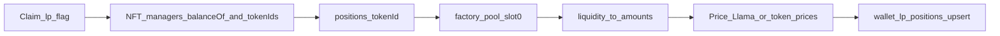

# Pending: LP positions discovery

**Status:** not implemented  
**Owner for next agent:** new Cursor agent (prompt at bottom)  
**Depends on (already live):** `wallet_token_contracts_discovery`, `wallet_token_portfolio_discovery`, `token_prices_import`, `wallets.wallet_token_positions` (fungible / `wallet` only)

## Goal

Materialize **liquidity-pool (concentrated liquidity) positions** per wallet+chain — not WAMI scores — in the same spirit as [Zerion complex positions](https://developers.zerion.io/api-reference/wallets/get-wallet-fungible-positions) (`only_complex` / LP legs grouped by `group_id`).

Today portfolio discovery only covers **simple wallet holdings** (native + ERC-20 balances). LP NFT managers are out of scope there.

## What exists today vs target

| Layer | Today | Target |
|---|---|---|
| Fungible wallet positions | `wallet_token_portfolio_discovery` → `wallet_token_positions` | Keep as-is |
| Price enrich | `token_prices_import` (Dex → CG → miss mark) | Reuse for LP underlying tokens |
| LP / Uniswap V3 NFT positions | **Missing** | New claim worker + schema |
| Standalone reference (local CLI) | `lp_extractor` (UniV3 / Pancake / Aerodrome): `tokenOfOwnerByIndex` + `positions(tokenId)` → token0/1, fee, ticks, liquidity — **no USD** | Port engine into worker; add pool `slot0` → amounts → USD |

## Suggested product shape

Prefer **separate table** (or clearly typed rows) rather than overloading fungible-only PKs:

Suggested name: `wallets.wallet_lp_positions` (or extend positions with `position_type` + LP columns if schema design prefers one table).

Minimum fields (Zerion-inspired):

| Field | Role |
|---|---|
| `wallet_id`, `chain_id` | Identity |
| `protocol` / `protocol_module` | e.g. `uniswap_v3`, `pancakeswap_v3`, `aerodrome` |
| `nft_manager_address`, `token_id` | NFT key |
| `pool_address` | Resolved pool |
| `token0_address`, `token1_address`, `fee` | Pair |
| `tick_lower`, `tick_upper`, `liquidity` | Raw UniV3 state |
| `amount0`, `amount1` (raw + float) | After `slot0` math |
| `price_usd_*` / `value_usd` | Via DeFiLlama and/or `token_prices` |
| `group_id` | Link both legs as one LP |
| `position_type` | e.g. `locked` / deposit-style |
| `quality` / error flags | Mirror fungible patterns where useful |
| `updated_at` | Snapshot time |

Worker does **not** compute WAMI / HUMI — only persists snapshot rows for later index SQL.

## Suggested worker design

| Item | Proposal |
|---|---|
| Folder | `workers/wallet_lp_positions_discovery/` |
| Workflow | `wallet-lp-positions-discovery.yml` |
| Schedule | Same as others: `0 0,6,12,18 * * *` UTC + `workflow_dispatch` |
| Claim surface | `erc_8004.wallet_transactions` (or `wallets`) with new flags, e.g. `does_need_lp_discovery` after portfolio done |
| Runtime | `MAX_RUNTIME_SECONDS=19800`, GHA `timeout-minutes: 360` |
| Pattern | Claim → RPC/Multicall → upsert RPC → mark done (copy `src/db.py` resilience from peers) |

### Pipeline (proposed)



1. Per chain with known NonfungiblePositionManager address(es).
2. `balanceOf(wallet)` → enumerate `tokenOfOwnerByIndex`.
3. `positions(tokenId)` → token0/1, fee, ticks, liquidity.
4. Resolve pool + `slot0` (`sqrtPriceX96`, tick).
5. Convert liquidity → token amounts.
6. Price underlyings (DeFiLlama first; fall back to `wallets.token_prices` / enrich queue).
7. Upsert LP rows; clear claim flag.

### Chains / protocols (v1)

Start with managers already known in standalone `lp_extractor` / `walcert` metadata for:

- Uniswap V3 (Ethereum, Base, Arbitrum, … where configured)
- Pancake V3 (BNB) where applicable
- Aerodrome (Base) where applicable

Skip chains without manager address / RPC rather than hard-failing the whole wallet.

## Schema work (`gsa-supabase-schema`)

1. Migration: table(s) + indexes `(wallet_id, chain_id)`, `(chain_id, nft_manager, token_id)` unique.
2. RPC: `wallets.wallet_lp_positions_upsert(...)` (or apply snapshot style).
3. Claim columns / trigger on `wallet_transactions` (e.g. set pending when portfolio discovery completes successfully).
4. Scripts under `supabase/scripts/` + short doc under `supabase/docs/`.
5. Deploy schema to prod **before** relying on worker.

## Out of scope (v1)

- Full lending / staking / restaking catalogs
- Historical LP fee accruals / PnL charts
- Calculating agent index pillars inside the worker
- Rewriting fungible portfolio discovery

## Acceptance checks

- [ ] Empty LP wallet completes claim and marks flag done
- [ ] Wallet with ≥1 UniV3 NFT gets row(s) with amounts and USD when prices exist
- [ ] Transient DB errors retry; empty queue exits 0
- [ ] Cron + `workflow_dispatch` documented in README / PROCESSES.md
- [ ] Monitoring SQL in SUPABASE.md (pending / error counts)

## References in this repo

- Live catalog: [PROCESSES.md](./PROCESSES.md)
- Fungible path: [workers/wallet_token_portfolio_discovery/README.md](../workers/wallet_token_portfolio_discovery/README.md)
- Pricing: [workers/token_prices_import/README.md](../workers/token_prices_import/README.md)
- Agent rules: [AGENTS.md](../AGENTS.md)

---

## Prompt for a new Cursor agent

Copy-paste into a **new agent / new chat** (Agent mode), with both workspace roots open (`gsa-workers` + `gsa-supabase-schema`):

```text
You are implementing the pending LP positions pipeline for Global Score Agent.

Read first (in order):
1. gsa-workers/AGENTS.md
2. gsa-workers/docs/PROCESSES.md
3. gsa-workers/docs/PENDING_LP_POSITIONS.md  ← full spec; follow this
4. gsa-workers/docs/ARCHITECTURE.md and docs/SUPABASE.md
5. Mirror patterns from workers/wallet_token_portfolio_discovery and workers/token_prices_import (claim loop, db retry, GHA cron 0/6/12/18 UTC, MAX_RUNTIME_SECONDS=19800)

Task:
- Design + implement schema in gsa-supabase-schema (table + upsert/RPC + claim flags/triggers + scripts/docs).
- Implement worker workers/wallet_lp_positions_discovery (+ workflow YAML + README).
- Port UniV3-style extraction inspired by standalone lp_extractor: NFT tokenIds → positions(tokenId) → pool slot0 → token amounts → USD (DeFiLlama and/or wallets.token_prices).
- Do NOT compute WAMI. Persist Zerion-like LP snapshot rows only.
- Deploy order: schema first, then worker. Update PROCESSES.md when live.
- Ask before destructive SQL (TRUNCATE / mass re-queue). Commit/push only when I ask.

Start by summarizing your plan (schema shape + claim flag design), then implement after I confirm—or if the PENDING doc decisions are enough, proceed and call out any material choice you made.
```
