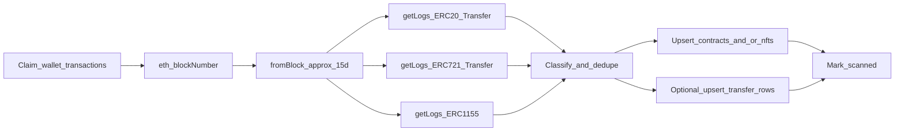

# Pending: wallet token activity scan (ERC-20 / 721 / 1155 via public RPC)

**Status:** probe census 15d **live** under `workers/token_activity/probe/` (getLogs sensor + enrich flags on Transfer); enrich worker TBD; native enrich enqueue → rollup (ADR)  
**Worker:** [`token_activity/probe`](../workers/token_activity/probe/) · workflow `wallet-token-activity-scan.yml`  
**Related live:** [`wallet_token_contracts_discovery`](../workers/wallet_token_contracts_discovery/) (Alchemy Free **current** balances only) · [TOKEN_CONTRACTS_DISCOVERY_ALCHEMY.md](./TOKEN_CONTRACTS_DISCOVERY_ALCHEMY.md)  
**Target product:** [token_activity/](./token_activity/) — census probe + enrich subset. Schema: `20260723010000_token_activity_probe_census_15d.sql` + matrix `20260723060000_…`.

> Historical design notes below; **code of truth** is the probe README + [token_activity/](./token_activity/) + migrations.
>
> Census: public RPC; lookback from `last_scanned` capped at **15d**; `next_eligible +15d`; no transfer persist; enrich flag on Transfer only (native D vs D−1 → rollup, not probe); ERC-1155 deferred.

## Goal (product)

Scan the **last ~15 days** of on-chain **token** activity for a wallet×chain using **public RPCs only** (`eth_getLogs`), and persist:

1. **Contracts touched** (for incremental inventory / refresh)  
2. Optionally **raw transfer rows** (hash, block, from, to, tokenId/amount)

**In scope:** ERC-20, ERC-721, ERC-1155  
**Out of scope for this worker:** Alchemy `external` (native txs) — separate follow-up that may use Alchemy Transfers with `category: ["external"]` only.

This complements (does not replace) Alchemy `getTokenBalances` discovery:

| Job | Question |
|---|---|
| `wallet_token_contracts_discovery` | ¿Qué ERC-20 tiene **ahora** (balance > 0)? |
| **This worker** | ¿Con qué tokens (20/721/1155) **interactuó** en ~15 días? |

## Why public RPC `getLogs` (not Alchemy Transfers for these)

Alchemy Transfers categories map to:

| Category | This worker |
|---|---|
| `erc20` | `eth_getLogs` + `Transfer(address,address,uint256)` |
| `erc721` | same event; usually 4 topics (`tokenId` indexed) — classify vs ERC-20 |
| `erc1155` | `TransferSingle` / `TransferBatch` topics |
| `external` | **Not here** — no universal log; leave for Alchemy-only worker later |

Keeping 20/721/1155 on public RPC reserves Alchemy quota for `external` (and Free key for holdings snapshot).

## Suggested worker design

| Item | Proposal |
|---|---|
| Folder | `workers/token_activity/probe/` (ex-`wallet_token_activity_scan`) |
| Workflow | `wallet-token-activity-scan.yml` |
| Schedule | `0 0,6,12,18 * * *` UTC + `workflow_dispatch` |
| Claim surface | `erc_8004.wallet_transactions` with new flags, e.g. `does_need_token_activity_scan` + `token_activity_scanned_at` |
| Cadence semantics | Eligible when never scanned **or** `token_activity_scanned_at <= NOW() - interval '15 days'` (refresh), **or** one-shot flag — pick one model and document it |
| Runtime | `MAX_RUNTIME_SECONDS=19800`, GHA `timeout-minutes: 360` |
| Secrets | `SUPABASE_DB_URL` only for v1 (public RPCs). Do **not** require `ALCHEMY_*` for this worker |
| Pattern | Claim → per-chain `getLogs` chunks → classify → upsert → mark done (copy `src/db.py` resilience from peers) |

### Pipeline



### RPC rules (must implement)

1. **Window:** `toBlock = latest`; `fromBlock` ≈ now − 15 days (per-chain block time estimate or binary search by timestamp). Make window configurable (`ACTIVITY_LOOKBACK_DAYS`, default `15`).
2. **Wallet involvement:** for each standard, query **twice** (or equivalent): wallet as `from` and as `to` (indexed topics).
3. **Chunking:** never assume one `eth_getLogs` for the full 15d window. Split into block ranges (start conservative, e.g. 2k–10k blocks; backoff / shrink on “query returned more than …” / timeout).
4. **RPC list:** reuse public fallback style from claim workers / standalone (`networks.py` pattern) — rotate URLs on failure; no Alchemy subdomain required for v1.
5. **Classify ERC-20 vs ERC-721:** same event signature; use topic count / optional `supportsInterface` — document heuristic; never silently merge NFT ids into fungible contract table without a `standard` column or separate table.
6. **Empty result:** still mark scanned (success); do not leave flag pending forever.
7. **Errors:** set error columns + advance or retry policy consistent with contracts discovery (prefer queue advances with `has_*_error` rather than infinite re-claim).

### Event topics (reference)

| Standard | Events |
|---|---|
| ERC-20 / ERC-721 | `Transfer(address,address,uint256)` — keccak topic0 shared |
| ERC-1155 | `TransferSingle(address,address,address,uint256,uint256)` and `TransferBatch(...)` |

Exact topic layouts: follow OpenZeppelin / EIP specs when packing indexed `from`/`to`.

## Schema work (`gsa-supabase-schema`) — decide in plan, then implement

**Minimum v1 (recommended):**

1. Claim columns on `wallet_transactions` (+ trigger or eligibility SQL).  
2. Reuse `wallets.wallet_token_contracts_upsert` for **ERC-20** contracts discovered in the window (`source = 'rpc_logs_15d'` or similar).  
3. New table(s) for NFT activity, e.g. `wallets.wallet_nft_transfers` or `wallet_token_transfers` with `standard ∈ {erc20,erc721,erc1155}` — **do not** force NFT rows into fungible-only PK without design review.

**Optional v1.1:** persist every transfer row (hash, logIndex, block, amounts/tokenId).

Deliver: migration + `supabase/scripts/` mirror + short doc + monitoring SQL in worker README / SUPABASE.md.

## Out of scope

- Alchemy `getAssetTransfers` / `external`  
- Alchemy `getTokenBalances` (already live)  
- Pricing / portfolio / LP discovery  
- WAMI scoring  
- Full history from genesis (15d window only unless env overrides for debug)

## Acceptance checks

- [ ] Wallet with no token activity in window completes and marks scanned  
- [ ] Wallet with ERC-20 transfers yields contracts upserted (or transfer rows)  
- [ ] ERC-721 / ERC-1155 detected without corrupting fungible inventory  
- [ ] Large activity ranges survive via block chunking (no single fatal “response too large”)  
- [ ] Public RPC failover works when first URL fails  
- [ ] Cron + `workflow_dispatch`; empty queue exits 0  
- [ ] `PROCESSES.md` / `AGENTS.md` updated when live  

## References

- Live catalog: [PROCESSES.md](./PROCESSES.md)  
- Holdings snapshot rationale: [TOKEN_CONTRACTS_DISCOVERY_ALCHEMY.md](./TOKEN_CONTRACTS_DISCOVERY_ALCHEMY.md)  
- Mirror claim/retry: `workers/wallet_token_contracts_discovery/`  
- Agent rules: [AGENTS.md](../AGENTS.md)  

---

## Prompt for a new Cursor agent

Copy-paste into a **new agent / new chat** (Agent mode), with both workspace roots open (`gsa-workers` + `gsa-supabase-schema`):

```text
You are implementing a new gsa-workers claim job: 15-day token activity scan via public RPC eth_getLogs (ERC-20 / ERC-721 / ERC-1155 only). No Alchemy for this worker.

Read first (in order):
1. gsa-workers/AGENTS.md
2. gsa-workers/docs/PROCESSES.md
3. gsa-workers/docs/PENDING_TOKEN_ACTIVITY_RPC.md  ← full spec; follow this
4. gsa-workers/docs/ARCHITECTURE.md and docs/SUPABASE.md
5. Mirror patterns from workers/wallet_token_contracts_discovery (claim loop, db retry, GHA cron 0/6/12/18 UTC, MAX_RUNTIME_SECONDS=19800)
6. Public RPC / networks patterns from claim workers (do not require ALCHEMY_* secrets)

Task:
- Design + implement schema in gsa-supabase-schema (claim flags + tables/RPCs as needed + scripts/docs). Prefer reusing wallet_token_contracts_upsert for ERC-20 discoveries; use a separate path/table for NFTs / transfer rows so fungible inventory stays clean.
- Implement `workers/token_activity/probe/` (done; was `wallet_token_activity_scan`) + workflow YAML + README.
- eth_getLogs only: ~15-day window, chunked block ranges, wallet as from and to, classify erc20 vs erc721 vs erc1155.
- Do NOT call Alchemy getAssetTransfers or getTokenBalances in this worker. Do NOT implement native/external transfers here.
- Deploy order: schema first, then worker. Update PROCESSES.md / AGENTS.md when live.
- Ask before destructive SQL (TRUNCATE / mass re-queue). Commit/push only when I ask.

Start by summarizing your plan (schema shape + claim flag / 15d refresh model + getLogs chunk strategy), then implement after I confirm—or if the PENDING doc decisions are enough, proceed and call out any material choice you made.
```
