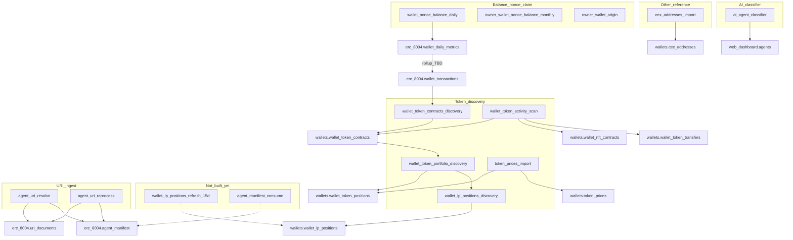

# Process catalog (gsa-workers)

End-to-end map of batch pipelines that run on GitHub Actions against Supabase Postgres. Entry points: [AGENTS.md](../AGENTS.md), [ARCHITECTURE.md](./ARCHITECTURE.md), [SUPABASE.md](./SUPABASE.md).

Sibling schema repo: **`gsa-supabase-schema`**.

## Pipeline diagram (token portfolio path)



## Live processes

| # | Process | Type | Schedule (UTC) | Queue / input | Persist via | Destination |
|---|---|---|---|---|---|---|
| 1 | [`wallet_nonce_balance_daily`](../workers/wallet_nonce_balance_daily/README.md) | Claim | 0/6/12/18 (matrix a/b) | `wallets` + daily flags | `wallet_apply_daily_snapshot` | `wallet_daily_metrics` (flat); rollup → `wallet_transactions` TBD |
| 2 | [`owner_wallet_nonce_balance_monthly`](../workers/owner_wallet_nonce_balance_monthly/README.md) | Claim | 0/6/12/18 | monthly flags | `wallet_apply_monthly_snapshot` | `wallet_owner_details` |
| 3 | [`owner_wallet_origin`](../workers/owner_wallet_origin/README.md) | Claim | 0/6/12/18 | history flags | `wallet_apply_owner_history_snapshot` | `wallet_owner_details.first_transaction_at` |
| 4 | [`cex_addresses_import`](../workers/cex_addresses_import/README.md) | Reference | 1st & 16th 00:00 | Dune API | `wallets.cex_addresses_upsert` | `wallets.cex_addresses` |
| 5 | [`wallet_token_contracts_discovery`](../workers/wallet_token_contracts_discovery/README.md) | Claim (`wallet_transactions`) | 0/6/12/18 | `does_need_discovery_contracts` | `wallet_token_contracts_upsert` | `wallets.wallet_token_contracts` |
| 6 | [`wallet_token_portfolio_discovery`](../workers/wallet_token_portfolio_discovery/README.md) | Claim (`wallet_transactions`) | 0/6/12/18 | `does_need_portfolio_discovery` | `wallet_token_positions_insert` | `wallets.wallet_token_positions` (wallet fungibles) |
| 7 | [`token_prices_import`](../workers/token_prices_import/README.md) | Reference | 0/6/12/18 | unpriced ERC-20s (`has_price_error`) | `token_prices_upsert` + `apply_prices` + `mark_price_misses` | `token_prices` → positions |
| 8 | [`wallet_lp_positions_discovery`](../workers/wallet_lp_positions_discovery/README.md) | Claim (`wallet_transactions`) | 0/6/12/18 | `does_need_lp_discovery` | `wallet_lp_positions_upsert` | `wallets.wallet_lp_positions` |
| 9 | [`wallet_token_activity_scan`](../workers/wallet_token_activity_scan/README.md) | Claim (`wallet_transactions`, matrix chain×shard) | 0/6/12/18 | `token_activity_next_eligible_at` + valid agents | contracts + nft_contracts + transfers upserts | ERC-20 / NFT collections / transfers (public getLogs) |
| 10 | [`agent_uri_resolve`](../workers/agent_uri_resolve/README.md) | Claim (agents / feedbacks) | 00:00, 12:00 | `is_uri_processed` / `is_feedback_processed` | direct SQL | `uri_documents` + `agent_manifest` |
| 11 | [`agent_uri_reprocess`](../workers/agent_uri_reprocess/README.md) | Claim (manifest errors + docs) | 06:00, 18:00 | download errors / off-chain &gt;15d | direct SQL | retry + refresh `uri_documents` |
| 12 | [`ai_agent_classifier`](../workers/ai_agent_classifier/README.md) | Claim (`web_dashboard.agents`) | 0/6/12/18 | `does_need_ai_category_process` | exact-hash copy or LLM | `ai_category_*` + `ai_category_input_hash` |

Soft runtime budget for claim / enrich jobs: **`MAX_RUNTIME_SECONDS=19800`** (~5.5h). Empty queue → exit 0; next cron still fires.

## Process details

### 1–3. Balance / nonce / origin (claim on `erc_8004.wallets`)

```
claim → multi-chain RPC → save JSON + status → wallet_apply_*_snapshot → Processed
```

Eligibility: `is_valid_*` + `*_next_eligible_at <= NOW()`. Soft lock via `next_eligible_at += CLAIM_STALE_SECONDS`.

**Daily only:** snapshot destination is `erc_8004.wallet_daily_metrics` (not `wallet_transactions`). Discovery pipelines (#5–#8) still claim existing `wallet_transactions` rows; new daily data does not refresh that table until a rollup job lands.

### 4. CEX addresses (reference)

Dune fetch → fail on empty → `cex_addresses_upsert`. No claim loop.

### 5. Token contracts discovery

Claims `wallet_transactions` where discovery is pending and Alchemy subdomain exists → `alchemy_getTokenBalances` → upsert contracts → mark flag done (even on error, with error columns). Business rationale (why ERC-20 inventory, Alchemy Free volume, price fallbacks): [TOKEN_CONTRACTS_DISCOVERY_ALCHEMY.md](./TOKEN_CONTRACTS_DISCOVERY_ALCHEMY.md).

### 6. Token portfolio discovery (fungible `wallet` positions)

After contracts OK → Alchemy amounts + **DeFiLlama only** → INSERT positions (`native` + ERC-20). Sets `token_quality` / `has_price_error`. Does **not** discover LP positions (see #8).

### 7. Token prices enrich

Distinct unpriced ERC-20s → cache TTL → DexScreener → CoinGecko → upsert spot cache → apply priced hits → **mark Dex+CG misses** as known-unknown (`quality_reason=unknown_token_dex_coingecko_defillama`, `has_price_error=false`) so they leave the enrich queue.

### 8. LP positions discovery

**Live.** Claims `wallet_transactions` after portfolio discovery succeeds.

```
claim → NFT (UniV3/Pancake) + classic (lp_pools) → price → wallet_lp_positions_upsert → mark done
```

| Item | Detail |
|---|---|
| Flag | `does_need_lp_discovery` (+ claim / error columns) |
| Destination | `wallets.wallet_lp_positions` (PK + FKs; `calculated_at`) |
| Classic registry | `wallets.lp_pools` (`active`); Aerodrome Base seeded |
| Empty wallet | Completes OK with `inserted=0` (most wallets) |
| Pricing | DeFiLlama first, then `wallets.token_prices` |
| WAMI | Not computed in worker |
| Workflow | `wallet-lp-positions-discovery.yml` |

Covered extractors: Ethereum / Base / Arbitrum UniV3 NFT; BNB Pancake V3 NFT; Base Aerodrome classic via `lp_pools`. Other Alchemy chains are still claimed and finish empty until coverage is added.

Worker README: [`wallet_lp_positions_discovery`](../workers/wallet_lp_positions_discovery/README.md). 15-day refresh still pending: [PENDING_LP_POSITIONS.md](./PENDING_LP_POSITIONS.md).

### 9. Token activity scan (public getLogs)

**Live.** Matrix GHA por chain×shard (`chains.token_activity_runner_count`). Un solo código; env `CHAIN`/`SHARD`/`SHARDS`.

```
claim batch 50 (valid agents + awt.is_valid + mod shard) →
  eth_getLogs Transfer from/to (OR topics) → classify erc20/erc721 →
  upsert contracts + nft_contracts + transfers → advance last_scanned_block
```

| Item | Detail |
|---|---|
| Cursor | `token_activity_last_scanned_block`; catch-up max 3d |
| Runners | DB column `token_activity_runner_count` (bsc/arb=4, eth/base/poly=2, …) |
| Secrets | `SUPABASE_DB_URL` only |
| Queue seed | Existing rows **not** enqueued by migrate — see `wallet_token_activity_scan_seed_queue.sql` |
| Workflow | `wallet-token-activity-scan.yml` |

Worker README: [`wallet_token_activity_scan`](../workers/wallet_token_activity_scan/README.md). Design notes: [PENDING_TOKEN_ACTIVITY_RPC.md](./PENDING_TOKEN_ACTIVITY_RPC.md).

### 10. Agent URI resolve (ingest)

**Live.** Replaces Edge `agent-uri-batch-processor` / `feedback-uri-batch-processor` for **first-time** URI materialize.

Loop priority per round:

1. **Agents** — `is_uri_processed = false` + non-empty `agent_uri_raw` → resolve (hex / data / IPFS / HTTP scrapers) → `uri_documents` (`uri_hash=md5(uri)`) + `agent_manifest` (`uri_document_id`, envelope; no `data`/`url` columns)
2. **On-chain feedbacks** — `feedback_type = feedback_on_chain` → DB-only upsert (`internal_on_chain_id_{id}`, `source='on_chain'`) — **no HTTP**
3. **External feedbacks** — `feedback_type` in (`feedback_uri`, `feedback_end_point`) → same resolve path as agents (`feedback_uri_raw` / `end_point`)

Import requeues hex/on-chain when source fields change (`is_uri_processed` / `is_feedback_processed`). Nested + DID each get their own `uri_documents` row. Soft `MAX_RUNTIME_SECONDS=19800`. Partial indexes: `idx_agents_pending_uri_processing`, `idx_rf_pending_uri_resolve`, `idx_rf_pending_on_chain`.

### 11. Agent URI reprocess (errors + off-chain refresh)

**Live.** Complements resolve on the other daily slots (`06:00` / `18:00`).

1. **Errors** — `agent_manifest` with `has_download_error` (max `reprocess_count` **3**; first try immediate; later tries need `updated_at` &gt; 3 days ago) or `does_need_manual_reprocess`. URI recovered from `agents` / `registration_feedbacks` via `provider`. On success clears error flags and sets `is_processed=false`.
2. **Refresh** — `uri_documents` with `status=valid`, HTTP/IPFS URI, `fetched_at` older than **15 days**. Hex / `data:` / `internal_on_chain_id_*` excluded. After fetch: if `document` **changed** → upsert + `is_processed=false` on linked manifests; if unchanged → renew TTL only.

Reuses resolve/handlers from `agent_uri_resolve` via `sys.path`. Indexes: `idx_am_pending_reprocess`, `idx_ud_pending_refresh_offchain`.

### 12. AI agent classifier

**Live.** Claims `web_dashboard.agents` where `does_need_ai_category_process IS TRUE`.

```
claim FOR UPDATE → one asyncio worker per llm provider → pick that provider's models → OpenAI-compat chat → write ai_category_* → models_requests++
```

| Item | Detail |
|---|---|
| Config | `llm.process` `agent-classifier` → `procees_llm_providers` → `llm_provider` + `models` |
| Categories | `web_dashboard.agent_ai_categories` (`is_active`) |
| Rate limit | `llm.models_requests` per model+date; rotate when `request_per_day` hit; exit 0 if all exhausted |
| API key | env named by `llm.llm_provider.secret` (Groq: `GROQ`); `base_url` on provider |
| Errors | flag `FALSE` + `has_ai_category_process_error` / `ai_category_process_error_message`; **requeued automatically at next job start** |
| Workflow | `ai-agent-classifier.yml` |

Worker README: [`ai_agent_classifier`](../workers/ai_agent_classifier/README.md).

## Pending / planned

| Doc / work | Status |
|---|---|
| [PENDING_LP_POSITIONS.md](./PENDING_LP_POSITIONS.md) | Discovery **live**; only **15-day refresh** worker remains |
| [PENDING_TOKEN_ACTIVITY_RPC.md](./PENDING_TOKEN_ACTIVITY_RPC.md) | **Live** as `wallet_token_activity_scan` (v1 Transfer); ERC-1155 deferred |
| Agent manifest **consume** | Not built — rewrite SQL readers to JOIN `uri_documents`, then GHA orchestrator; keep legacy pg_cron consume **off** |

## Secrets cheat sheet

| Secret | Used by |
|---|---|
| `SUPABASE_DB_URL` | All |
| `ALCHEMY_KEY` | Balance/nonce claim workers (fallback RPC) |
| `ALCHEMY_FREE_KEY` | Contracts + portfolio + LP discovery |
| `DUNE_KEY` | CEX import |
| `COINGECKO_KEY` | Token prices enrich |
| `PINATA_GATEWAY` | URI resolve / reprocess (optional IPFS) |
| `SCRAPE_DO_TOKEN` | URI resolve / reprocess (optional HTTP fallback) |
| `GROQ` | AI agent classifier (Groq; name matches `llm.llm_provider.secret`) |

## When schema vs worker

| Change | Repo |
|---|---|
| Claim SQL, GHA, HTTP clients, job loops | **gsa-workers** |
| Tables, RPCs, triggers, indexes, flags | **gsa-supabase-schema** |
| Deploy | Schema first (if needed) → push worker → `workflow_dispatch` or wait for cron |
