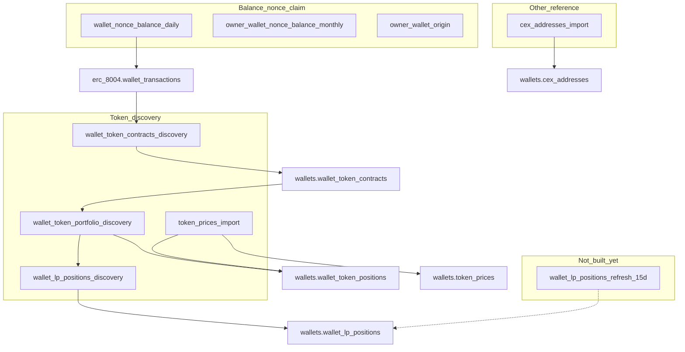

# Process catalog (gsa-workers)

End-to-end map of batch pipelines that run on GitHub Actions against Supabase Postgres. Entry points: [AGENTS.md](../AGENTS.md), [ARCHITECTURE.md](./ARCHITECTURE.md), [SUPABASE.md](./SUPABASE.md).

Sibling schema repo: **`gsa-supabase-schema`**.

## Pipeline diagram (token portfolio path)



## Live processes

| # | Process | Type | Schedule (UTC) | Queue / input | Persist via | Destination |
|---|---|---|---|---|---|---|
| 1 | [`wallet_nonce_balance_daily`](../workers/wallet_nonce_balance_daily/README.md) | Claim | 0/6/12/18 (matrix a/b) | `wallets` + daily flags | `wallet_apply_daily_snapshot` | `wallet_transactions`, `chain_nonces` |
| 2 | [`owner_wallet_nonce_balance_monthly`](../workers/owner_wallet_nonce_balance_monthly/README.md) | Claim | 0/6/12/18 | monthly flags | `wallet_apply_monthly_snapshot` | `wallet_owner_details` |
| 3 | [`owner_wallet_origin`](../workers/owner_wallet_origin/README.md) | Claim | 0/6/12/18 | history flags | `wallet_apply_owner_history_snapshot` | `wallet_owner_details.first_transaction_at` |
| 4 | [`cex_addresses_import`](../workers/cex_addresses_import/README.md) | Reference | 1st & 16th 00:00 | Dune API | `wallets.cex_addresses_upsert` | `wallets.cex_addresses` |
| 5 | [`wallet_token_contracts_discovery`](../workers/wallet_token_contracts_discovery/README.md) | Claim (`wallet_transactions`) | 0/6/12/18 | `does_need_discovery_contracts` | `wallet_token_contracts_upsert` | `wallets.wallet_token_contracts` |
| 6 | [`wallet_token_portfolio_discovery`](../workers/wallet_token_portfolio_discovery/README.md) | Claim (`wallet_transactions`) | 0/6/12/18 | `does_need_portfolio_discovery` | `wallet_token_positions_insert` | `wallets.wallet_token_positions` (wallet fungibles) |
| 7 | [`token_prices_import`](../workers/token_prices_import/README.md) | Reference | 0/6/12/18 | unpriced ERC-20s (`has_price_error`) | `token_prices_upsert` + `apply_prices` + `mark_price_misses` | `token_prices` → positions |
| 8 | [`wallet_lp_positions_discovery`](../workers/wallet_lp_positions_discovery/README.md) | Claim (`wallet_transactions`) | 0/6/12/18 | `does_need_lp_discovery` | `wallet_lp_positions_upsert` | `wallets.wallet_lp_positions` |

Soft runtime budget for claim / enrich jobs: **`MAX_RUNTIME_SECONDS=19800`** (~5.5h). Empty queue → exit 0; next cron still fires.

## Process details

### 1–3. Balance / nonce / origin (claim on `erc_8004.wallets`)

```
claim → multi-chain RPC → save JSON + status → wallet_apply_*_snapshot → Processed
```

Eligibility: `is_valid_*` + `*_next_eligible_at <= NOW()`. Soft lock via `next_eligible_at += CLAIM_STALE_SECONDS`.

### 4. CEX addresses (reference)

Dune fetch → fail on empty → `cex_addresses_upsert`. No claim loop.

### 5. Token contracts discovery

Claims `wallet_transactions` where discovery is pending and Alchemy subdomain exists → `alchemy_getTokenBalances` → upsert contracts → mark flag done (even on error, with error columns).

### 6. Token portfolio discovery (fungible `wallet` positions)

After contracts OK → Alchemy amounts + **DeFiLlama only** → INSERT positions (`native` + ERC-20). Sets `token_quality` / `has_price_error`. Does **not** discover LP positions (see #8).

### 7. Token prices enrich

Distinct unpriced ERC-20s → cache TTL → DexScreener → CoinGecko → upsert spot cache → apply priced hits → **mark Dex+CG misses** as known-unknown (`quality_reason=unknown_token_dex_coingecko_defillama`, `has_price_error=false`) so they leave the enrich queue.

### 8. LP positions discovery

After portfolio OK → step 1 UniV3/Pancake NFT managers + step 2 active `wallets.lp_pools` (Aerodrome classic) → amounts → DeFiLlama/`token_prices` → `wallet_lp_positions_upsert` (replace snapshot; stamps `calculated_at`). No WAMI.

## Pending / planned

| Doc | Status |
|---|---|
| [PENDING_LP_POSITIONS.md](./PENDING_LP_POSITIONS.md) | **Initial discovery live**; 15-day refresh worker still pending |

## Secrets cheat sheet

| Secret | Used by |
|---|---|
| `SUPABASE_DB_URL` | All |
| `ALCHEMY_KEY` | Balance/nonce claim workers (fallback RPC) |
| `ALCHEMY_FREE_KEY` | Contracts + portfolio + LP discovery |
| `DUNE_KEY` | CEX import |
| `COINGECKO_KEY` | Token prices enrich |

## When schema vs worker

| Change | Repo |
|---|---|
| Claim SQL, GHA, HTTP clients, job loops | **gsa-workers** |
| Tables, RPCs, triggers, indexes, flags | **gsa-supabase-schema** |
| Deploy | Schema first (if needed) → push worker → `workflow_dispatch` or wait for cron |
